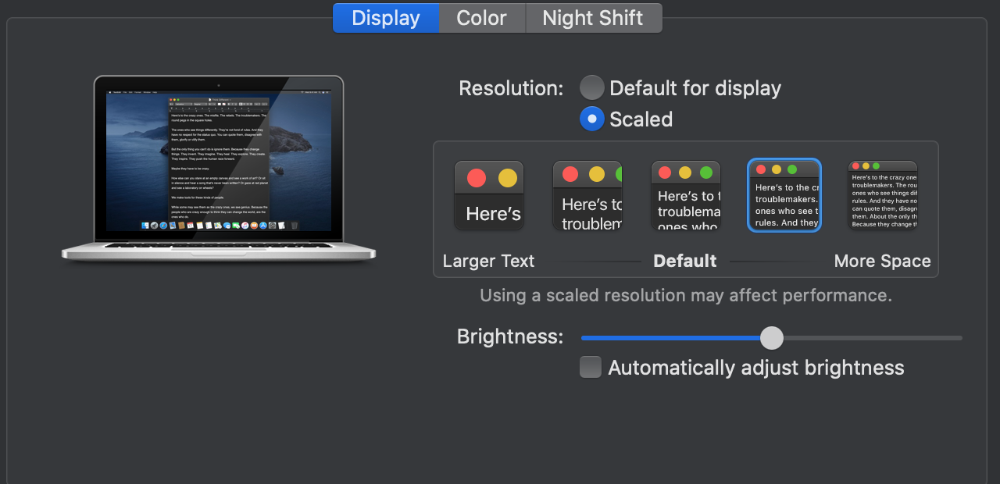

### Set Up for Nearest Similarity between Macbook Pro 2015 15 inch and VS Code
Problem :

A little annoyed on vs code and terminal os not same theme (color, font, etc). Very unsightly :(

---

Ingridient :
- brew (package manager) : https://brew.sh/
- iterm2 : https://iterm2.com/
- zsh (shell) : https://github.com/ohmyzsh/ohmyzsh/wiki/Installing-ZSH
- oh-my-zsh (framework zsh) : https://ohmyz.sh/
- VS Code : https://code.visualstudio.com/
  - github theme : https://marketplace.visualstudio.com/items?itemName=GitHub.github-vscode-theme
- tools theme convert vs code to iterm2 : https://github.com/campvanilla/ditto
- font
  - JetBrains Mono (main) : https://www.jetbrains.com/lp/mono/
  - Source Code Pro (backup) : https://github.com/adobe-fonts/source-code-pro

---

Step (install using brew or manually) :
- set display scale to this

- install brew -> iterm2 -> zsh -> ohmyzsh
- zsh setting (or just copy file)
  - settingn plugin : plugins=(brew git git-prompt github docker)
  - change font to JetBrains Mono
  - font : 11 
  - line height : 120
- install vs code -> github theme
- vs code setting (or just copy file)
  - change font to JetBrains Mono
  - workspace font : 13
  - terminal font : 11
  - terminal line height : 1.2
  - tab : 2
- migrate theme vs code to zsh using tools
- use migrate file on iterm2 -> preferences -> colors -> import

---

NB :
- I'm use OS Catalina
- Maybe for inspiration set up
- It's not final setup, maybe i change it if i'm boring or there something new